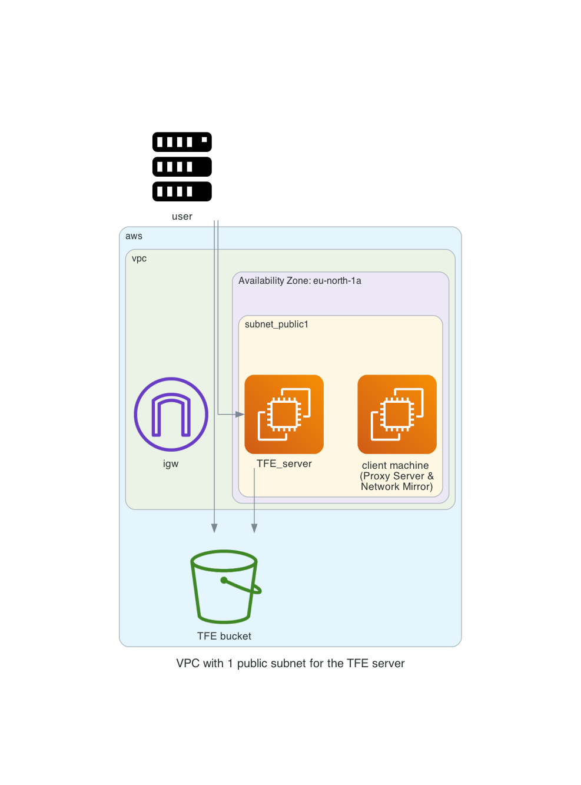

# Terraform Enterprise installation mounted disk

With this repository you will be able to do a TFE FDO (Terraform Enterprise) online installation Mounted Disk with Podman for the container management. The data will be stored to mount point `/opt/tfe/data`

The Terraform code will do the following steps

- Create S3 buckets used for TFE to store certificates
- Generate TLS certificates with Let's Encrypt to be used by TFE
- Create a VPC network with subnet, security group, internet gateway
- Create a EC2 instance on which the TFE installation will be performed in mounted disk mode

# Diagram

  

# Using a proxy server
Use a proxy server with this TFE following these steps described [here](proxy-server.md) after everything is build

# Prerequisites

## AWS
We will be using AWS. Make sure you have the following
- AWS account  
- Install AWS cli [See documentation](https://docs.aws.amazon.com/cli/latest/userguide/install-cliv2.html)

## Install terraform  
See the following documentation [How to install Terraform](https://learn.hashicorp.com/tutorials/terraform/install-cli)

## TLS certificate
You need to have valid TLS certificates that can be used with the DNS name you will be using to contact the TFE instance.  
  
The repo assumes you have no certificates and want to create them using Let's Encrypt and that your DNS domain is managed under AWS. 

# How to

- Clone the repository to your local machine
```
git clone https://github.com/munnep/tfe_fdo_podman_disk.git
```
- Go to the directory
```
cd tfe_fdo_podman_disk
```
- Set your AWS credentials
```
export AWS_ACCESS_KEY_ID=
export AWS_SECRET_ACCESS_KEY=
export AWS_SESSION_TOKEN=
```
- create a file called `variables.auto.tfvars` with the following contents and your own values
```
tag_prefix                 = "tfe32"                         # TAG prefix for names to easily find your AWS resources
region                     = "eu-north-1"                    # Region to create the environment
vpc_cidr                   = "10.231.0.0/16"                 # subnet mask that can be used   
dns_hostname               = "tfe32"                         # DNS hostname for the TFE
dns_zonename               = "aws.munnep.com"                # DNS zone name to be used
tfe_password               = "Password#1"                    # TFE password for the dashboard and encryption of the data
certificate_email          = "patrick.munne@hashicorp.com"   # Your email address used by TLS certificate registration
public_key                 = "ssh-rsa AAAAB3Nza"             # The public key for you to connect to the server over SSH
tfe_release                = "v202309-1"                     # Version number for the release to install. This must have a value
tfe_license                = "<very_secret>"                 # license file being used
terraform_client_version   = "1.1.7"                         # Terraform CLI version installed on the client machine
```
- Terraform initialize
```
terraform init
```
- Terraform plan
```
terraform plan
```
- Terraform apply
```
terraform apply
```
- Terraform output should create 34 resources and show you the public dns string you can use to connect to the TFE instance
```
Apply complete! Resources: 34 added, 0 changed, 0 destroyed.

Outputs:

private_ip = "10.115.1.23"
ssh_tf_client = "ssh ubuntu@tfe32-client.aws.munnep.com"
ssh_tfe_server = "ssh ec2-user@tfe32.aws.munnep.com"
tfe_appplication = "https://tfe32.aws.munnep.com"
tfe_ip = "ssh ubuntu@52.212.76.15"
```
- You can now login to the application with the username `admin` and password specified in your variables.


# TODO

# Done
- [x] build network according to the diagram
- [x] use standard ubuntu 
- [x] create a virtual machine in a public network with public IP address.
    - [x] firewall inbound are all from user building external ip
    - [x] firewall outbound rules
          AWS bucket
- [x] Create a valid certificate to use 
- [x] Create an AWS bucket
- [x] create an elastic IP to attach to the instance
- [x] point dns name to public ip address
- [x] transfer files to TFE virtual machine
      - TLS certificates
- [x] install TFE

# notes and links
[EC2 AWS bucket access](https://aws.amazon.com/premiumsupport/knowledge-center/ec2-instance-access-s3-bucket/)