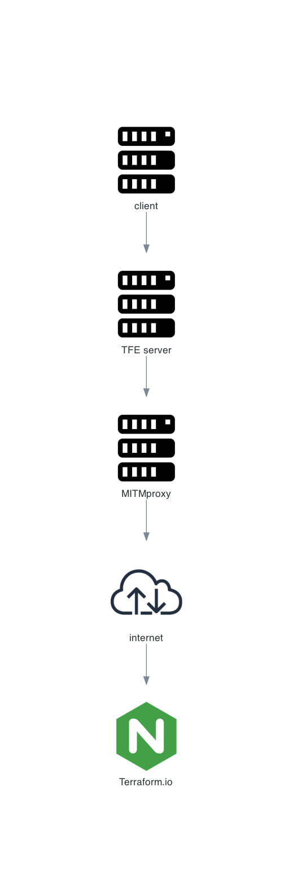

# Making the TFE application use the proxy server
Please make sure you created the environment as described in the [README.md](README.md). These are just extra steps if you would like to do testing with a proxy server. 

The client machine has a proxy server up and running. These are the steps for the TFE - FDO instance to actually use this proxy server. 

# Diagram


# How to

- Login to the TFE instance
- Get the certificate for the proxy server and install these on the TFE instance itself
```
curl --proxy http://10.115.1.23:8080 -o /var/tmp/proxy.pem http://mitm.it/cert/pem
cp /var/tmp/proxy.pem /usr/local/share/ca-certificates/proxy.crt
update-ca-certificates
```

sudo cp /var/tmp/proxy.pem /etc/pki/ca-trust/source/anchors/
update-ca-trust

export https_proxy=http://10.115.1.23:8080
export http_proxy=http://10.115.1.23:8080
export HTTPS_PROXY=http://10.115.1.23:8080
export http_proxy=http://10.115.1.23:8080

{
  "data-root": "/tfe/docker",
  "proxies": {
    "default": {
      "httpProxy": "http://10.115.1.23:8080",
      "httpsProxy": "http://10.115.1.23:8080",
      "noProxy": "localhost, tfe66.aws.munnep.com,127.0.0.1"
    }
  }
}


cp /var/tmp/proxy.pem /etc/pki/ca-trust/source/whitelist/
- Add the certificate to the CA bundle used by TFE
```
cat /var/tmp/proxy.pem >> /opt/tfe/certs/bundle.pem
```
- Add the following environment variables to the `compose.yaml` file
```yaml
http_proxy: http://10.115.1.23:8080
https_proxy: http://10.115.1.23:8080
no_proxy: localhost,127.0.0.1,tfe66.aws.munnep.com
```
- Stop/start the Terraform Enterprise application
```
systemctl stop terraform-enterprise
systemctl start terraform-enterprise
```
- Now your TFE instance will use the proxy server to connect to the internet and the agent/custom agent will do the same
- To verify the configuration of the task worker you can verify the following
```
docker exec -it terraform-enterprise-tfe-1 cat /run/terraform-enterprise/task-worker/config.hcl
```
This configuration file should show you something like the following
```
    HTTPS_PROXY           = "http://10.115.1.23:8080"
    HTTP_PROXY            = "http://10.115.1.23:8080"
    NO_PROXY              = "localhost,127.0.0.1,tfe66.aws.munnep.com"
```    
- See the logs of the proxy server by logging into the client server
```
ssh client-server
```
- See the logs
```
journalctl -f -u mitmdump.service
```
